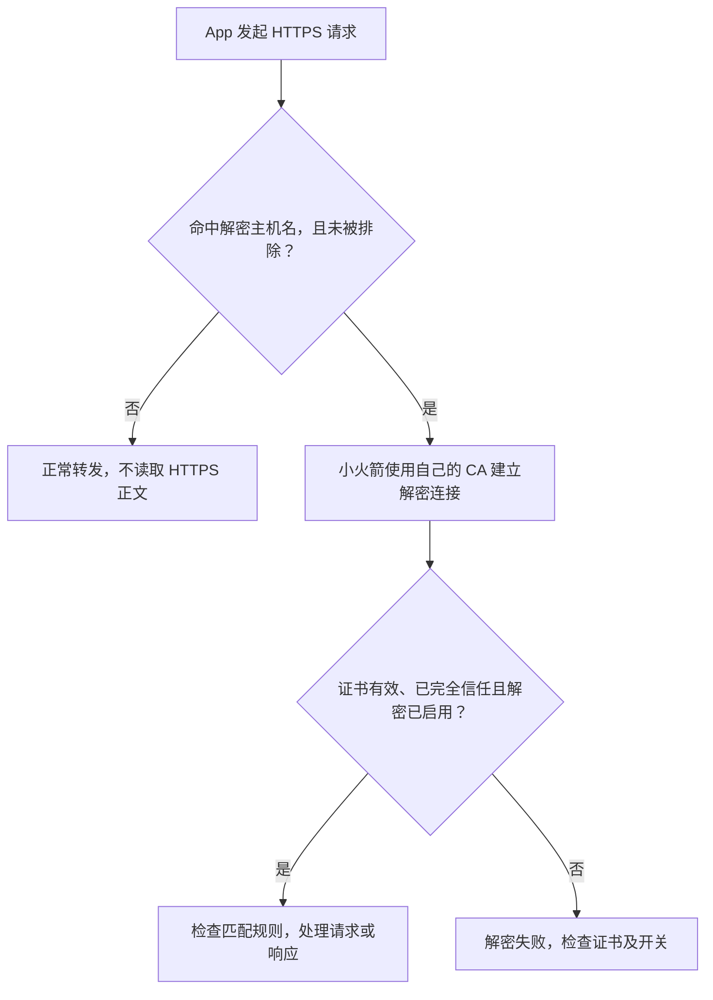
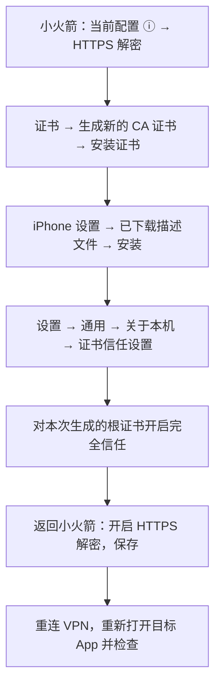
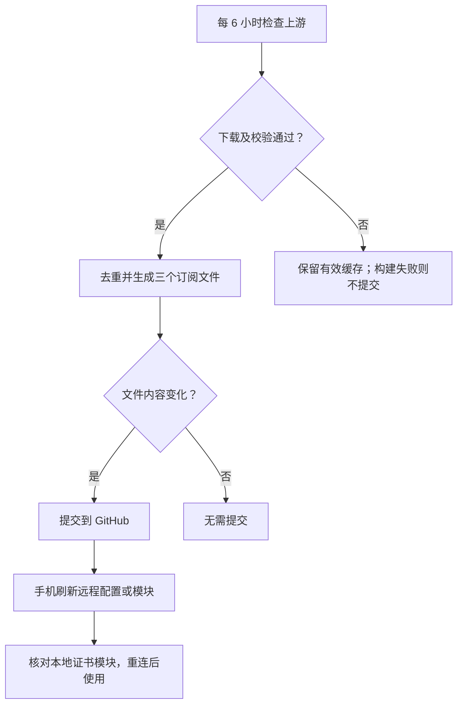

# Shadowrocket 国内核心广告订阅

面向国内常用 App 的去广告与功能增强配置，提供完整配置和两个独立模块。仓库已经发布，GitHub Actions 每 6 小时检查批准的核心库和配置实际引用的远程脚本、规则集。

> 新手按下面顺序操作：**导入并选中配置 → 生成自己的证书 → 安装描述文件 → 完全信任证书 → 开启 HTTPS 解密 → 重新连接并检查。**
>
> **安装证书、信任证书、开启解密是三个独立步骤，缺少任何一步，都可能导致 HTTPS 脚本不生效。**

## 1. 选择导入方式

| 文件 | 适用情况 | 订阅链接 |
| --- | --- | --- |
| 完整配置 | 希望直接使用本项目的完整分流、去广告和增强 | [shadowrocket.conf](https://raw.githubusercontent.com/juscice/shadowrocket-subscription/main/dist/shadowrocket.conf) |
| 去广告模块 | 保留现有配置，只加入本项目去广告 | [adblock.sgmodule](https://raw.githubusercontent.com/juscice/shadowrocket-subscription/main/dist/adblock.sgmodule) |
| 功能增强模块 | 保留现有配置，按需加入本项目增强 | [enhance.sgmodule](https://raw.githubusercontent.com/juscice/shadowrocket-subscription/main/dist/enhance.sgmodule) |

完整配置已经包含两个模块的功能，**使用完整配置时不要重复添加它们**。两个独立模块可配合自己的配置使用。本项目不提供代理节点，仍需添加自己的节点并检查策略组选项。

微信读书脚本保持 `enable=true`；该脚本来自旧版兼容方案，开启状态不代表当前 App 版本一定有效，服务端会员权益也不保证改变。项目没有进行 iPhone 全部 App 的实际效果测试。

### 完整配置的导入

1. 复制完整配置的订阅 URL。
2. 打开 Shadowrocket → **配置** → 右上角 **＋**，从 URL 下载配置；菜单名称以你的版本为准。
3. 在配置列表中选中下载的配置，确认它是当前生效的配置。
4. 添加自己的代理节点，检查首页的全局路由为 **配置**，检查代理分组是否有可用节点。
5. 开启远程配置的自动后台更新，再按下文设置 HTTPS 解密。

### 独立模块的导入

Shadowrocket → **配置 → 模块 → ＋**，分别填入需要的模块 URL，下载并启用；继续选中自己的主配置。模块中的解密主机名使用 `%APPEND%` 追加，仍要检查其他模块是否覆盖了主机名或解密开关。

## 2. HTTPS 解密的作用

域名拦截根据目标域名拒绝连接，通常不需要查看 HTTPS 正文。涉及 HTTPS 请求路径、广告数据字段、响应正文和部分功能增强的规则，则需要 HTTPS 解密后才能处理。

下面是工作原理示意，并非手机操作界面的截图：



规则匹配、App 版本及服务端接口仍会影响最终效果。部分 App 使用证书固定或自己的证书校验，即使系统信任证书，也可能无法解密。

## 3. 首次安装：生成 → 安装 → 信任 → 开启

**本项目的完整配置默认 `MITM enable=false`，也没有附带任何 CA 证书。** 请在自己的 iPhone 上生成证书。证书名称可能带有生成时间，以本次生成的名称为准。



### 第一步：在小火箭生成证书

进入 **配置**，点当前使用配置右侧的 **ⓘ** → **HTTPS 解密 → 证书 → 生成新的 CA 证书**。随后选择 **安装证书**，按提示允许下载证书描述文件；如果打开浏览器，请完成该下载流程。

如果已有自己生成、安装并信任的有效证书，可复用同一张证书，不必每次更新都重新生成。不要导入来源不明的共享 CA。

### 第二步：在 iOS 安装描述文件

打开 iPhone **设置 → 已下载描述文件**，核对证书名称和来源，点 **安装**，按照设备提示完成安装；设备锁屏密码只在手机系统中输入。

若设置首页没有入口，到 **设置 → 通用 → VPN 与设备管理** 查看下载或安装的描述文件。下载后长时间未安装可能需要回到小火箭重新下载；Apple 说明，未安装的已下载描述文件会在 8 分钟后被删除。

安装的是你刚刚生成的证书描述文件，不是这个项目的 `.conf` 配置文件。遇到与证书无关的设备管理注册要求，应停止并核对来源。

### 第三步：开启根证书完全信任

进入 **设置 → 通用 → 关于本机 → 证书信任设置**，在 **针对根证书启用完全信任** 下，找到刚安装的证书，打开对应开关，并确认系统提示。

**描述文件安装完成不会自动获得 SSL/TLS 完全信任。** 如果没有相应证书，请先核对第二步是否完成；不要误把其他公司的根证书当成本次小火箭证书。

### 第四步：回到小火箭开启解密

回到 **当前配置 ⓘ → HTTPS 解密**，确认使用的是同一张证书，开启 HTTPS 解密并保存。保持项目已有的解密主机名及排除项，不要把主机名直接改成 `*`。

返回首页，断开后重新连接 VPN，再完全退出并重新打开目标 App，以便新连接使用当前设置。

### 第五步：检查是否完成

| 检查位置 | 应看到的状态 |
| --- | --- |
| 设置 → 通用 → VPN 与设备管理 | 本次生成的证书描述文件已安装 |
| 设置 → 通用 → 关于本机 → 证书信任设置 | 同一张根证书的完全信任开关已打开 |
| 小火箭 → 当前配置 → HTTPS 解密 | 解密已启用，证书与上述证书对应 |
| 小火箭 → 配置 / 模块 | 正确的配置被选中，需要的模块已启用 |
| 小火箭请求记录与目标 App | 对命中主机名的请求查看解密/脚本错误，并检查实际页面变化 |

不要仅用“广告暂时没有出现”判定证书安装成功，也不要以某个没有命中主机名的普通网站正常打开来证明解密成功。

## 4. 自动更新时保留自己的证书（建议）

远程更新会重新下载公开配置；本项目生成的完整配置仍是 `enable=false`，且不含你的证书。不要依靠对远程文件的本地改动长期保存证书。**完成首次安装和信任后，建议在手机内创建一个独立的本地证书模块。**

1. 小火箭 → 当前已经可以解密的配置 **ⓘ → HTTPS 解密 → 证书 ⓘ → 复制**。
2. 同一页面复制证书密码；密码以你实际证书的值为准。
3. **配置 → 模块 → 新建模块**，将下面模板中的两处占位文字替换为自己的证书内容、密码，保存并启用。

```ini
#!name=我的本地解密证书
#!desc=仅存放在自己的设备；不要上传或共享
[MITM]
enable=true
ca-passphrase=替换为自己的证书密码
ca-p12=替换为自己的证书内容
```

占位文字不是有效证书；**不要在尚未填写完整时启用该模板**。证书模块不写 `hostname`，让解密范围继续由主配置和功能模块提供。模块设置优先于主配置，启用该证书模块后，不要仅根据主配置中 `enable=false` 判断实际状态；检查合并后的状态和请求记录。

每次更新或切换配置后，检查本地证书模块仍然存在、启用且没有冲突。新设备需要在自己的 iOS 系统中重新安装并信任所使用的证书；重新生成证书后也要重新安装、信任并更新模块，避免系统信任旧证书、小火箭使用新证书。

`ca-p12` 包含证书和私钥，`ca-passphrase` 是对应密码。**二者都不得上传到本公开仓库、发到 Issue 或放入订阅链接。** 本地证书模块也不要作为远程模块公开分享。

## 5. 常见问题与恢复方法

| 情况 | 优先检查与处理 |
| --- | --- |
| 没有“已下载描述文件” | 回到小火箭重新安装证书，立即打开设置；也查看 VPN 与设备管理 |
| 没有“证书信任设置”里的对应证书 | 描述文件是否真正安装，是否装的是根证书，名称是否与本次生成一致 |
| 安装成功但脚本没有效果 | 完全信任、解密开关、当前配置、模块启用、目标主机名、脚本请求记录逐项核对 |
| 提示 `No PKCS12 Certificates` | 先停用未填完整的本地证书模块，在当前配置生成并安装信任有效 CA，再填入证书模块 |
| 更新后解密关闭 | 主配置被远程版本替换；检查已填写的本地证书模块是否仍启用、是否被其他模块覆盖 |
| 显示证书不受信任或 TLS 失败 | 核对生成、安装、信任的是同一张证书，以及证书是否过期、设备时间是否正确 |
| 只有某个 App 无法连接 | 可能有证书固定或接口变化；先停用该 App 的解密/相关模块对照检查，不强行绕过 App 校验 |
| VPN 或页面异常 | 先关闭解密；若有本地证书模块强制开启，要同时停用它，再重连并检查 |
| 想彻底移除自己的解密证书 | 先停用证书模块和解密，再在 VPN 与设备管理中移除自己创建的证书描述文件；不要误删其他管理文件 |

只对自己的设备和需要处理的请求启用解密。已有的金融、认证排除项需保留，但这不代表覆盖所有 App 的敏感接口；遇到登录、支付异常先恢复该 App 的正常连接。

## 6. 自动更新与手机刷新



仓库更新与手机更新是两个环节。在小火箭开启配置或模块的自动后台更新；iOS 后台调度不保证立即刷新，需要时手动更新。HTTPS 解密所需的私人证书只保留在自己的设备中。

### 更新范围和校验

GitHub Actions 在 UTC 00:17、06:17、12:17、18:17 计划运行（日本时间09:17、15:17、21:17、03:17），也可在 Actions → Update Shadowrocket subscription → Run workflow 手动运行。

1. 刷新 ACL4SSR 的广告联盟、App广告、国内网页广告三份核心库。NobyDa仅作为有限国内SDK端点补充，不整库导入。
2. 将实际引用的远程规则集和脚本复制到本仓库 `upstream/`，生成文件引用本仓库路径。上游脚本或规则字节变化会成为本仓库提交。
3. 按域名后缀、关键词和CIDR去重，保留金融与认证排除设置，禁止重新膨胀到28万条。广告规则数量上限20,000。
4. 对下载的JavaScript只做语法检查，不执行。上游请求失败或脚本语法不通过时继续用最近的有效缓存版本；第一次没有缓存的引用会在报告中标记unavailable，保留原始引用，不宣称成功。
5. 重建 `dist/` 并验证微信读书保持启用、健康域名不被域名广告库拒绝。验证失败则不提交。无文件变化则不提交。

GitHub计划运行可能延迟，也可能受Actions关闭、仓库权限、使用额度或公共仓库长期无活动导致的停用影响。检查Actions最近一次成功记录确认运行状态。

更新范围是配置**实际引用的规则集、脚本和批准的核心库**。`profiles/`中经筛选的App原生URL/正文匹配器是固定策略快照；其他网站新增模块、更换接口路径或整份模块结构变化不会被未经比较自动合入。GKD的安卓界面点击选择器不参与小火箭构建。

## 7. 维护项目

- `profiles/full.conf`：自己的完整分流和策略模板。
- `profiles/adblock.sgmodule`、`profiles/enhance.sgmodule`：经比较的App请求处理模板。
- `profiles/app-rules.list`：保留的App广告分流增量。
- `sources.json`：批准的核心源和仓库地址。
- `dist/update-report.json`：各引用内容摘要、刷新或回退状态。

不要修改 `dist/`：下一次构建会覆盖。修改 `profiles/` 后工作流会自动重建。新增脚本路径或规则集URL也会进入引用刷新流程；上游脚本仍可改变App响应，应先人工审查新功能。

本地验证：

```sh
python3 tools/test_update.py
python3 tools/update.py --offline
```

正常刷新：

```sh
python3 tools/update.py
```

仓库已包含初始缓存与 `app-rules.list`，不需要再次运行 `--bootstrap`。更换仓库时修改sources.json；在GitHub Actions内使用实际GITHUB_REPOSITORY生成raw路径。

公开仓库内容只包含规则、配置与公开上游脚本，不要在profiles中加入节点密码、共享证书私钥、个人Cookie或Token。

## 8. 参考资料

- [Apple：手动安装证书后开启完全信任](https://support.apple.com/zh-cn/102390)。
- [Apple：安装配置描述文件](https://support.apple.com/zh-cn/102400)。
- [Apple：查看及移除描述文件](https://support.apple.com/zh-cn/guide/iphone/iph6c493b19/27/ios/27)。
- [Shadowrocket 社区使用指南：HTTPS 解密、模块与本地证书模块](https://github.com/jinofhust/shadowrocket/blob/main/README.md)；此为社区资料，菜单可能随版本变化。
- [Reqable 官方文档源码：iOS 证书及无法解密的情况](https://github.com/reqable/reqable-docs/blob/master/zh-CN/getting-started/installation/index.md)。

说明核对日期：2026-10-05。本文不附带任何真实证书、私钥或账户凭据。流程图为操作示意，并非 App 官方界面截图。
